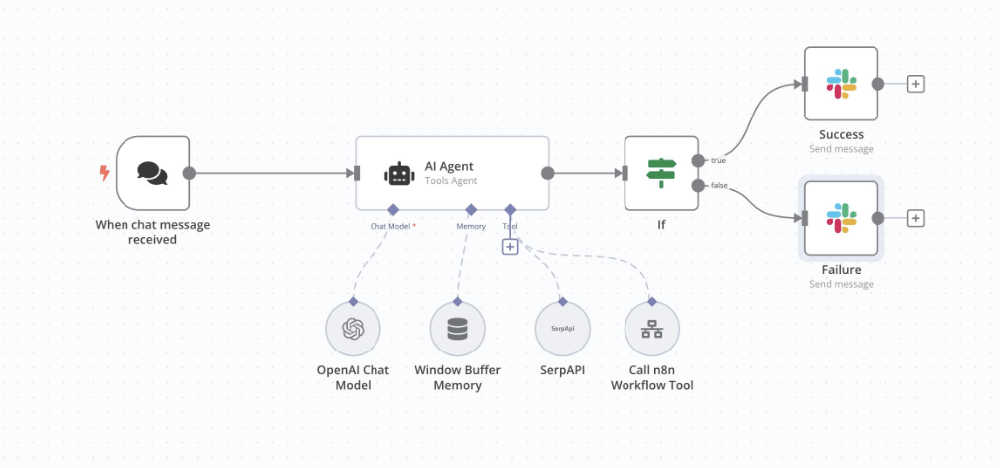

# AI Automation Agent
### Intelligent Message Classification and Automated Response System
## Project Preview

An AI-powered workflow automation prototype developed using n8n and OpenAI to classify incoming messages and support automated customer communication.

## Overview

This project explores how Artificial Intelligence and workflow automation can reduce repetitive tasks in customer communication processes.

The agent receives incoming messages, identifies their intent, assigns a category, and supports the generation of contextual responses.

The project was developed as part of my academic work in Artificial Intelligence and Data Analytics.

## Problem Statement

Customer communication processes often involve repetitive requests that require manual classification and routing.

This can increase response times and create additional operational workload.

## Solution

The proposed solution integrates an AI language model into an n8n workflow to classify messages into four categories:

- Support
- Sales
- Complaint
- Information

Based on the classification, the workflow can support the corresponding response or routing process.

## Technologies

- n8n – Workflow automation
- OpenAI GPT-4o-mini – Natural language processing
- Webhooks – Event-based workflow integration
- AI-powered classification – Message categorization

## Workflow Architecture

Incoming Message → AI Classification → Conditional Routing → Response Generation

## Workflow Implementation

The complete n8n workflow is available here:

[View and download the n8n workflow](./ai-automation-agent-workflow.json)

## Key Features

- Automated message classification.
- AI-powered natural language understanding.
- Workflow orchestration using n8n.
- Conditional logic for message handling.
- Potential integration with customer support processes.

## Business Applications

This architecture can be adapted to:

- Customer support automation.
- Lead classification.
- Marketing communication workflows.
- Customer onboarding assistance.
- Operational process optimization.

## Limitations

This repository represents an academic prototype.

Production deployment would require additional validation, error handling, monitoring, security controls, and end-to-end testing.

## Future Improvements

- Integrate structured analytics and performance tracking.
- Add human review for sensitive messages.
- Connect the workflow to a CRM.
- Measure response time and classification accuracy.
- Explore applications in user onboarding and activation.

## Author

**Michelle Morales Martínez**

Biomedical Engineer | AI & Data Analytics Specialist

Universidad de Caldas

GitHub: MichelleM222
